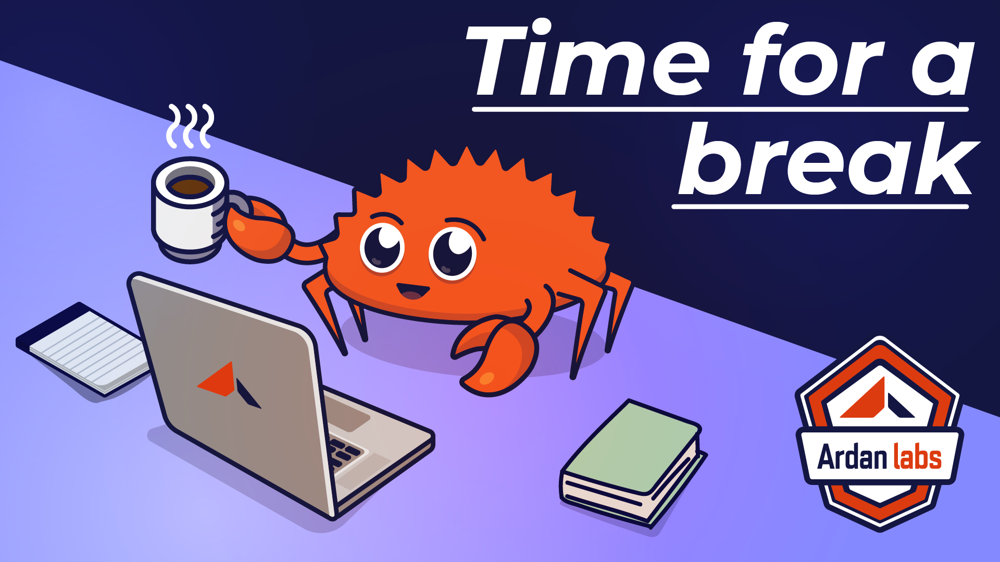

# Break



<table>
<tr>
<td>

```cpp
#include <thread>
#include <vector>
#include <iostream>

int main() {
  int counter = 0;
  std::vector<std::thread> handles;
    
  for (int i=0; i<3; i++) {
    handles.push_back(
      std::thread([&counter]() { 
        for (int i=0; i<100000; i++) {
          counter++; 
        }
      })
    );
  }

  for (int i=0; i<handles.size(); i++) {
    handles[i].join();
  }

  std::cout << "Counter: " << counter << "\n";
  return 0;
}
```

</td><td>

```
Counter: 140809
Counter: 144510
Counter: 174370
```

</td></tr></table>

